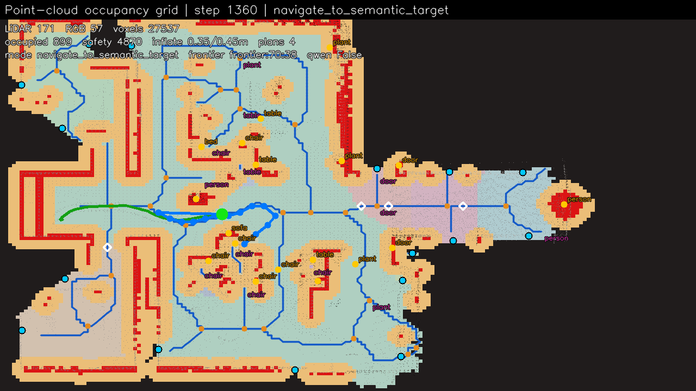
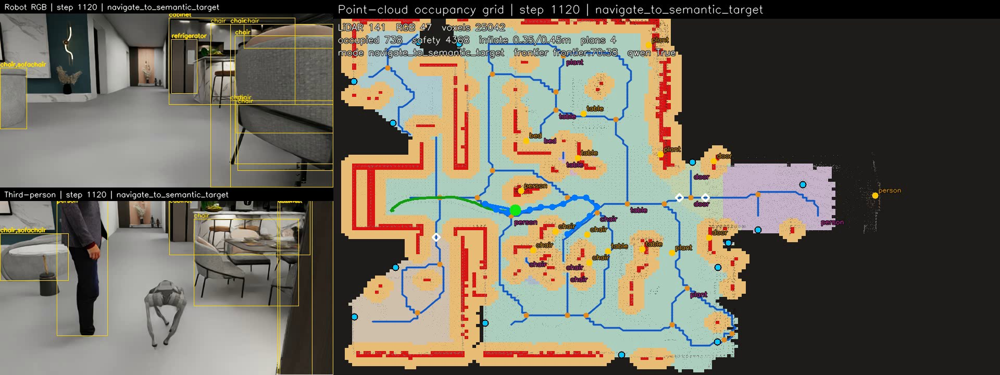
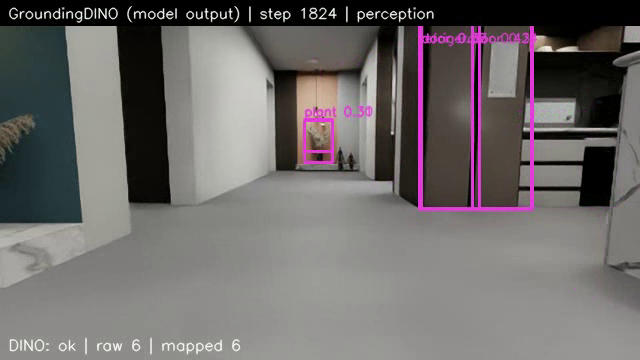
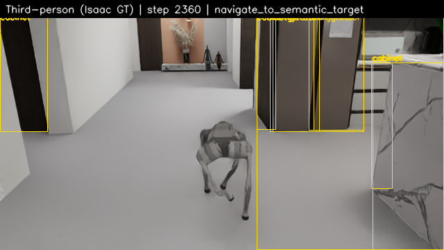
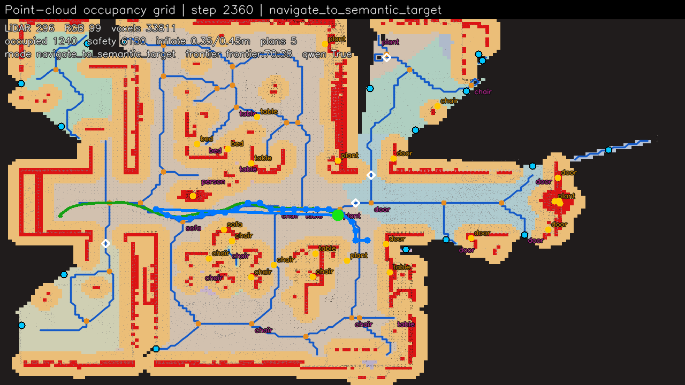
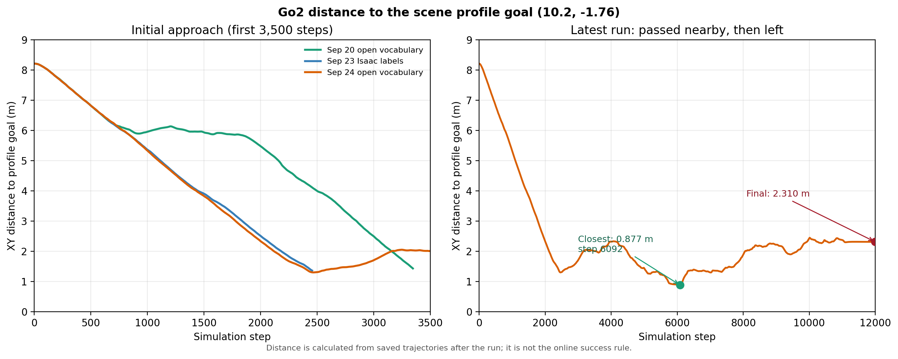

# Go2 开放词汇语义导航技术周报

**时间：2026 年 9 月 19—25 日。** 本报告依据服务器 `/data/zzx/inter-nav-project` 的运行代码、测试、检测记录、视频和结果 JSON 整理。最新实验为 9 月 25 日 19:22 启动的纯开放词汇运行。场景参考冰箱坐标 `(10.2, -1.76)` 只用于事后测距；在线成功按机器人到规划接近点的 XY 距离判断。

## 本周结论

**原来有什么问题：** GroundingDINO 已在画面中多次识别 `refrigerator door`，但同帧归并可能只留下置信度更高的 `door`，目标节点因而无法积累足够的冰箱标签。

**如何改进：** 保留归并前的各类标签证据后，9 月 25 日新一轮运行在第 800 步前确认冰箱，并于第 2365 步按配置判定成功。机器人到了冰箱附近；最终到接近点 **1.0998 m**，阈值 **1.10 m**，仅余 **0.0002 m**，因此这次结果尚不能证明稳定停靠或物体交互。

## 1. 感知服务与运行模式

**原来有什么问题：** 9 月 20 日一次开放词汇运行出现 500 次感知失败、0 帧有效结果。服务未就绪时继续仿真，会把“未识别到目标”与“模型根本没有运行”混在一起；混合模式若静默使用 Isaac 真值，也会掩盖开放词汇故障。

**如何改进：** 启动 Isaac 前检查 GroundingDINO、MobileSAM 和本地 CLIP；明确记录请求模式、实际模式和启动错误；纯 `open_vocab` 模式不回退到 Isaac 标签，连续三次运行时感知失败即停止。逐个保留检测处理错误。最新运行记录 **99 帧有效开放词汇感知、0 次服务失败**，因此其语义结果确实来自开放词汇链路。

## 2. Voronoi 增量地图

**原来有什么问题：** 将相距较远的地图变化装进一个大矩形窗口，会触发不必要的重算。窗口边界的 seam-band 一致性检查能发现局部接缝问题，却不能单独证明整张骨架图与全量重建完全相同。

**如何改进：** 按变化区域分别建立局部窗口，仅合并相交的影响范围，并以窗口并集面积决定是否回退全量构建；保留 seam-band 检查。新增可选的全量骨架逐格核对，用于 smoke 实验，普通导航默认关闭以控制开销。该优化通过 **250 次随机更新**和 **63 次真实轨迹回放**的逐格比较。最新导航记录了 132 次 seam 检查、47 次接缝不匹配与 25 次全量回退；本轮未开启全量核对，不能把它当成在线速度或全图一致性的新证明。

**跨周运行对照：** 上周 9 月 17 日的混合语义运行记录了 134 次增量成功、70 次全量回退（回退率 34.3%）；9 月 20 日旧窗口方案的纯开放词汇运行则为 16 次成功、67 次回退（80.7%）。两轮场景状态和轨迹不同，说明回退率会随地图变化分布波动，不能直接拿它们与新运行相减来计算优化收益。更可比的是 9 月 21 日同轨迹的两版实现：两轮均评估 62 次增量更新、经历 13,084 个变化格，轨迹均为 2,459 点；延后固定边距后，增量成功 **32→41**，全量回退 **30→21**（减少 30%），回退率 **48.4%→33.9%**，全图构建 **32→23**。从最初的大窗口方案到最终方案，四轮运行中的回退率由 83.9% 降至 33.9%，但只有最后两轮满足上述逐项可比条件。详见[Voronoi 窗口优化报告](../incremental-voronoi-window-optimization-report.md)。

9 月 25 日修复标签后的纯开放词汇运行有 35 次增量成功、25 次全量回退，回退率 **41.7%**，27 次全图构建；25 次回退均由窗口覆盖面积超过阈值触发。它证明新方案在另一轮真实导航中继续工作，但与上周各轮不构成控制变量实验。上述次数反映重建工作量，**不等于已测得端到端运行加速**。

## 3. 候选目标误确认

**原来有什么问题：** 9 月 23 日第一轮开放词汇 smoke 曾把椅子候选报为冰箱成功，终点距场景参考冰箱 **4.168 m**；另一轮把只有 5 次观测、短暂标成冰箱的远处门当作目标。这说明 `target_found` 或单次高置信度标签都不足以宣告成功。

**如何改进：** 将候选发现、语义确认和接近点到达分开。相似度候选先用于调查；确认要求同一场景图节点累计至少 8 次目标匹配标签，且匹配比例达到 60%，或者同一个目标短语重复出现至少 8 次。机器人还须进入所选接近点的到达半径。短暂误标被挡住；但 9 月 24—25 日的修复前长跑仍未确认真实冰箱，推动了下一项归并修复。

## 4. 冰箱标签在节点归并中丢失

**原来有什么问题：** 9 月 25 日一次中断的运行保存了 31 个已映射的冰箱相关检测，其中 25 个为 `refrigerator door`、6 个为 `refrigerator`，但 `target_confirmed` 始终为 false。29 次检测旁边还有 0.75 m 内的 `door` 框，其中 24 次普通门的置信度更高。代码会把同帧相近且外观相似的检测合成一个几何观测，却只保留一个主标签；场景图随后只累计该主标签。因为这轮中断后没有最终地图，无法精确追溯每次标签损失，但代码路径与观测高度吻合。

**如何改进：** 合并几何时保留该观测内的所有不同标签，同一次合并的每个标签只计一次；场景图分别累计 `door` 与 `refrigerator door`。切换目标节点时优先比较与 `refrigerator` 相关的证据，再比较总观测数，避免普通门的高频观测压过冰箱证据。64 项针对性测试通过，包括“普通门置信度更高，前 7 帧不确认、第 8 帧确认”的回归案例。最新真实运行的目标节点主标签仍是 `door`，但累计了 **100 次 `door`、15 次 `refrigerator door`、1 次 `refrigerator`**；`target_confirmed` 在第 800 步的进度记录中已为 true。

## 5. GroundingDINO 输出可追溯性

**原来有什么问题：** 旧视频里的黄色 `refrigerator` 框来自 Isaac 场景真值，不能用它证明 GroundingDINO 识别正确；此前缺少模型原始框与导航状态对应的记录。

**如何改进：** 为每次实际检测保存 GroundingDINO 原始框、标签、置信度和三维映射记录，输出独立的 `groundingdino.mp4` 与 `groundingdino_detections.jsonl`；机器人相机视频仅在对应查询步显示模型框，第三人称画面明确标注 Isaac 真值。运行时标准输出保持精简。下左图的黄色框是旧 Isaac 真值示例；下右图的紫色框才是新运行第 1824 步的 GroundingDINO 输出。

## 6. 终点判断与运行结果记录

**原来有什么问题：** 仅凭 `final_map.json`、候选目标存在或视频中“曾经过冰箱附近”，容易把失败、未完成和成功混淆。9 月 24 日长跑距参考冰箱最近 **0.877 m**，却最终离开到 **2.310 m**；9 月 25 日修复前长跑也曾接近 **0.966 m**，最终因 12000 步上限失败。

**如何改进：** 每轮默认使用独立输出目录，写入 `run_summary.json`，区分 `running`、`failed` 和 `succeeded`，并分别保存语义确认、接近点距离、场景参考距离和规划统计。周期性标准输出仅保留少量进度字段。新运行第 **2365 步**正常结束，`target_confirmed=true`、`arrival_verified=true`；机器人终点 `(9.298, -0.748)`，距规划接近点 **1.0998 m**，距场景参考坐标 **1.3561 m**。第三人称画面和俯视图支持“到达冰箱附近”，但到达余量只有 0.0002 m，不能写成已接触冰箱或稳定停靠。

## 7. 仍需解决的问题

**原来有什么问题：** 当前到达规则是“进入接近点 1.10 m 半径”，且新结果几乎恰好压线；它没有验证机器人停稳、持续保持在目标附近或冰箱是否正面可达。中断运行可能留下 `status: running` 和无法播放的未封口视频。不同运行的 Qwen 开关、感知服务实例和模型权重也未完全固定，不能将轨迹差异全部归因于单一代码改动。

**如何改进：** 下一阶段优先检查接近点是否落在真正可站立的冰箱前方，并增加短时间稳定停靠或连续多帧距离条件；将目标节点和接近点变化写入低频事件记录，定位突然换点及长时间停滞。为用户中断增加可靠的视频与结果收尾。做严格对照实验时固定场景、Qwen 设置、服务进程和权重；继续用椅子、误标门、真实冰箱三类案例检验误报与漏报。

## 关键运行对照

**原来有什么问题：** 不同实验曾把误报成功、经过目标附近和最终抵达混为一谈，单看最近距离容易得出相反结论。

**如何改进：** 对每轮同时列出终态与到场景参考目标的最近、最终距离，并在解释中注明是否使用 Isaac 真值。

| 运行 | 终态 | 到场景参考冰箱最近 / 最终距离 | 解释 |
| --- | --- | --- | --- |
| 9 月 23 日 Isaac 真值核对 | 第 2458 步成功 | 1.356 / 1.356 m | 验证几何接近点规则，不代表开放词汇识别。 |
| 9 月 23 日开放词汇早期 smoke | 第 1364 步误报成功 | 4.168 / 4.168 m | 椅子候选被当成冰箱。 |
| 9 月 24 日开放词汇长跑 | 第 11999 步失败 | 0.877 / 2.310 m | 曾接近，最终离开。 |
| 9 月 25 日归并修复前长跑 | 第 11999 步失败 | 0.966 / 1.558 m | 检测服务正常，目标未确认。 |
| 9 月 25 日标签归并修复后 | 第 2365 步按阈值成功 | 1.356 / 1.356 m | 冰箱节点累计 16 次目标标签；到接近点 1.0998 m，成功余量 0.0002 m。 |

这些距离是对场景参考坐标的**离线测量**，并非在线成功阈值。不同运行尚未构成严格控制变量实验；本周最可靠的新结论是：标签证据归并修复在真实开放词汇运行中触发了冰箱确认，机器人进入了配置的接近范围，但稳定停靠仍待验证。
